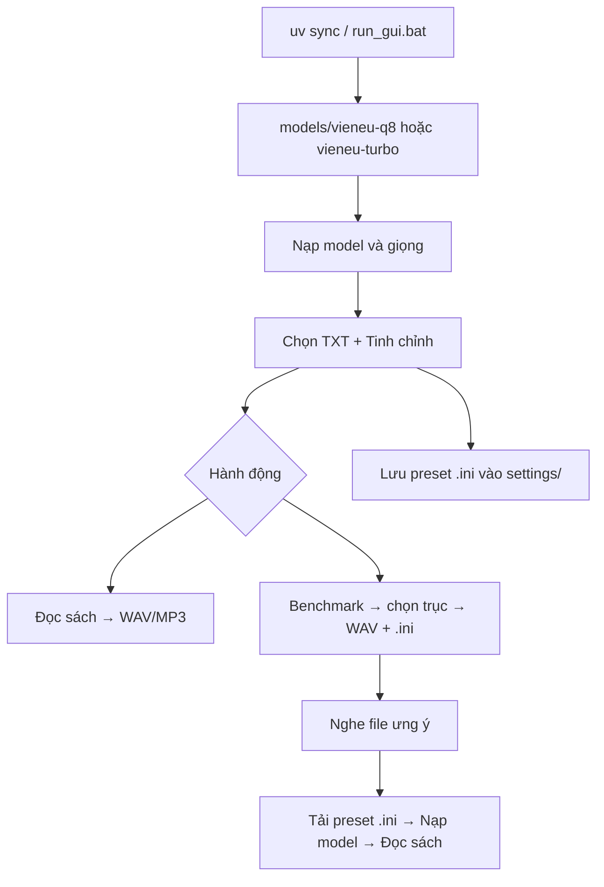

# Txt2Audio — TXT sách → audio (VieNeu-TTS)

Ứng dụng **desktop có GUI (Tkinter)** đọc file **TXT** (sách, văn bản dài) bằng **VieNeu-TTS** (package [`vieneu`](https://pypi.org/project/vieneu/)), xuất **WAV** hoặc **MP3**. Hỗ trợ hai dòng model **GGUF offline trên CPU**:

| Dòng model | Repo Hugging Face | Backend SDK | Thư mục trong `models/` |
|------------|-------------------|-------------|-------------------------|
| **Turbo** | [VieNeu-TTS-v2-Turbo-GGUF](https://huggingface.co/pnnbao-ump/VieNeu-TTS-v2-Turbo-GGUF) | `turbo` | `vieneu-turbo/` |
| **Q8 (standard)** | [VieNeu-TTS-q8-gguf](https://huggingface.co/pnnbao-ump/VieNeu-TTS-q8-gguf) | `standard` | `vieneu-q8/` |

Chương trình **tự nhận loại model từ tên file `.gguf`** (ví dụ `turbo`, `q8` trong tên) — không cần chọn repo thủ công. Mỗi loại model có **cây thư mục riêng** (codec ONNX, `voices.json`) để tránh trộn preset Turbo với Q8.

> **Lưu ý pháp lý / nội dung:** audio do model tạo có **watermark AI** theo mô tả upstream. Dùng có trách nhiệm; ghi công VieNeu-TTS khi phát hành.

---

## Tính năng chính

- **GUI:** chọn TXT, thư mục/tên output, giọng preset hoặc **clone** từ WAV/MP3/FLAC.
- **Đọc sách dài:** chia đoạn theo đoạn văn / câu / giới hạn ký tự; ghép PCM với im lặng và crossfade.
- **Hai backend:** Turbo và Q8 (`LocalPathStandardVieNeuTTS` + codec ONNX local).
- **Model portable:** weight trong `models/` — copy project sang máy khác.
- **Xuất WAV** (24 kHz) hoặc **MP3** qua **ffmpeg** (128 / 32 kbps).
- **Tinh chỉnh TTS:** temperature, top_k, cụm infer, im lặng, crossfade, v.v.
- **Tự áp mặc định Q8/Turbo** khi đổi GGUF hoặc sau «Nạp model & giọng» (trừ khi vừa tải preset `.ini` có `[tuning]`).
- **Preset `.ini`:** lưu / tải **nhiều file** cấu hình GUI (`settings/` hoặc đường dẫn tùy chọn).
- **Benchmark giọng:** hộp thoại chọn trục tham số quét → nhiều WAV + **`.ini` cùng tên`** để so sánh và import lại.

---

## Luồng sử dụng (GUI)



1. **Thư mục model** — mặc định `./models`.
2. **File GGUF** — `vieneu-q8/....gguf` hoặc `vieneu-turbo/....gguf`.
3. **«Nạp model & giọng»** — đợi xong rồi chọn giọng (hoặc clone).
4. Chỉnh **Tinh chỉnh** (hoặc **Tải preset** từ `.ini` đã lưu).
5. **«Bắt đầu đọc sách»** hoặc **«Benchmark giọng»** (chọn trục trong hộp thoại).
6. **«Dừng»** — hủy sau bước hiện tại.

---

## Cấu trúc thư mục

```
Txt2Audio/
  README.md
  pyproject.toml
  uv.lock
  requirements.txt       # pip fallback: vieneu + neucodec
  run_gui.bat
  settings/              # preset .ini do người dùng lưu (tự tạo)
  models/
    vieneu-q8/           # *.gguf, neucodec-onnx/, voices.json
    vieneu-turbo/
  scripts/
    import_hf_cache_to_models.py
    migrate_models_to_split_dirs.py
  src/txt2audio/
    app.py
    tts_worker.py
    text_chunker.py
    synthesis_tuning.py
    gui_settings.py       # đọc/ghi preset .ini
    benchmark.py
    benchmark_plan.py     # trục + dải giá trị quét
    benchmark_dialog.py   # hộp thoại chọn trục
    gguf_loader.py
    model_paths.py
    local_assets.py
    local_standard_backend.py
    audio_export.py
```

---

## Chuẩn bị model offline

- **Turbo:** `.gguf` trong `models/vieneu-turbo/`.
- **Q8:** `.gguf` trong `models/vieneu-q8/` + thư mục **`neucodec-onnx/`**.

```powershell
cd d:\CodeApp\Txt2Audio
.\.venv\Scripts\python.exe scripts\import_hf_cache_to_models.py
.\.venv\Scripts\python.exe scripts\import_hf_cache_to_models.py --repo q8
.\.venv\Scripts\python.exe scripts\migrate_models_to_split_dirs.py
```

---

## Cài đặt & chạy

```powershell
cd d:\CodeApp\Txt2Audio
uv sync
```

- Python **>= 3.10, < 3.14**; RAM **≥ 8 GB** khuyến nghị.
- **ffmpeg** nếu xuất MP3.

```powershell
uv run txt2audio
# hoặc
run_gui.bat
```

**Pip:** `pip install -r requirements.txt` (đã gồm `vieneu` và `neucodec`).

---

## Panel Tinh chỉnh

| Tham số | Ý nghĩa |
|---------|---------|
| **segment_chars** | Trần độ dài mỗi *đoạn sách* (mặc định 8000). Chia theo đoạn `\n\n`, câu — không cắt cứng đủ 8000 ký tự. |
| **infer_max_chars** | Độ dài tối đa mỗi lần `infer` trong một đoạn. |
| **silence_between_s** | Im lặng khi ghép waveform đoạn sách (“nhịp”, “hết hơi” giữa cụm lớn). |
| **crossfade_between_s** | Crossfade giữa đoạn sách khi ghép. |
| **infer_silence_p** | Im lặng giữa cụm infer (**Q8**). |
| **infer_crossfade_p** | Crossfade infer (**Q8**). |
| **temperature** | Ảnh hưởng chất giọng / biến thiên rõ nhất. Q8 ~1.0; Turbo ~0.4. |
| **top_k** | Lấy mẫu top-k. |
| **skip_normalize** | Bỏ **chuẩn hóa văn bản** trước infer (xem mục dưới). |
| **turbo_max_tokens** | Giới hạn token mỗi infer (**Turbo**). |
| **show_infer_progress** | Thanh tiến độ infer (**Turbo**). |

**Nút Mặc định Q8 / Turbo** — reset nhanh theo backend.

**Tự động:** đổi file GGUF hoặc nạp model xong → app áp bộ mặc định tương ứng (không ghi đè nếu vừa **Tải preset** có `[tuning]`).

### `skip_normalize` là gì?

- **Không** chỉnh âm thanh (volume, EQ).
- Là bước **chuẩn hóa chữ** (số → cách đọc, viết tắt, dấu câu…) trước phonemize/G2P.
- **Tắt** (mặc định): nên dùng cho sách TXT thường có số, %, tên riêng.
- **Bật:** chỉ khi TXT đã được làm sạch thủ công; có thể đọc sai số/từ lạ.
- **Q8:** tham số có hiệu lực rõ. **Turbo:** SDK có thể vẫn normalize trong `phonemize_text` — checkbox có thể ít khác biệt.

**Mẹo giọng tự nhiên:** tăng im lặng infer/sách (Q8), hạ `temperature` nhẹ; tránh `infer_max_chars` quá nhỏ.

---

## Preset cài đặt (file `.ini`)

Lưu **toàn bộ GUI** (đường dẫn, model, giọng, output, tinh chỉnh) — **không** nhúng config trong code.

| Nút | Việc làm |
|-----|----------|
| **Lưu preset…** | Chọn tên file (gợi ý: `settings/turbo_binh.ini`) |
| **Tải preset…** | Mở bất kỳ `.ini` |
| **Tải từ danh sách** | Combobox các `.ini` trong `settings/` |

Sau **Tải preset:** bấm **«Nạp model & giọng»** để áp GGUF + giọng đã lưu.

Cấu trúc file: `[meta]`, `[paths]`, `[model]`, `[output]`, `[tuning]`.

---

## Benchmark giọng

### Trước khi chạy

- Giống đọc sách: model đã nạp, đã chọn giọng hoặc clone, có TXT.
- Bấm **Benchmark giọng** → **hộp thoại chọn trục** (tick từng nhóm tham số, xem trước số file).

### Trục có thể quét (mỗi giá trị = 1 WAV + 1 `.ini`)

| Trục | Ghi chú |
|------|---------|
| **Baseline** | 1 file — đúng panel Tinh chỉnh hiện tại |
| **Temperature** | Turbo: 8 mức (0.25–0.6); Q8: 10 mức (0.7–1.25) |
| **infer_silence_p** | 7 mức — **chỉ Q8** |
| **silence_between_s** | 8 mức |
| **infer_max_chars** | 7 mức (192–640) |
| **top_k** | 5 mức (tắt mặc định) |
| **Crossfade infer / ghép** | Tắt mặc định |
| **Combo tự nhiên** | 1 file — temp + im lặng dài |

Nút **Mặc định gợi ý** / **Chọn tất cả** / **Bỏ chọn tất cả** trong hộp thoại.

### Kết quả

Thư mục `benchmark_<tên_txt>_<timestamp>/`:

- `07_book_silence_long__temp1__max384__sb0.35__si0.15.wav`
- `07_book_silence_long__temp1__max384__sb0.35__si0.15.ini` — **cùng tên**, import bằng «Tải preset»
- `summary.txt` — bảng variant / wav / ini / mô tả / tham số

**Đọc tên file:** `temp` = temperature, `max` = infer_max_chars, `sb` = silence_between_s, `si` = infer_silence_p (Q8).

**Quy trình gợi ý:** Benchmark → nghe WAV ưng ý → **Tải preset** file `.ini` cùng tên → **Nạp model** → **Đọc sách** (hoặc **Lưu preset** vào `settings/`).

Spinbox **Mẫu benchmark** — số ký tự đầu TXT (mặc định 500). Luôn xuất **WAV** (không ffmpeg).

---

## Xử lý văn bản & audio

1. Đọc TXT UTF-8.
2. `book_segments()` — đoạn / câu / cắt cứng.
3. `infer` theo `infer_max_chars` + `SynthesisTuning`.
4. `join_audio_chunks` + xuất WAV/MP3.

Sách dài có thể chạy hàng giờ; GUI dùng worker thread.

---

## Giọng đọc

- **Preset** từ `voices.json` đúng repo (Q8 ≠ Turbo).
- **Clone** từ file tham chiếu (ưu tiên hơn preset khi đọc).
- Đổi GGUF → **nạp lại model**.

---

## Xử lý sự cố

| Triệu chứng | Gợi ý |
|-------------|--------|
| `No module named 'neucodec'` | `uv sync` |
| Giọng sai loại model | Tách `vieneu-q8` / `vieneu-turbo`; nạp lại model |
| Audio rỗng | Kiểm tra tên `.gguf`, Q8 cần `neucodec-onnx/` |
| MP3 lỗi | Cài / chỉ đường dẫn ffmpeg |
| Robot / “hết hơi” | Im lặng + temperature; dùng **Benchmark** + preset `.ini` |
| Benchmark quá lâu | Bỏ bớt trục trong hộp thoại (chỉ tick Temperature, v.v.) |

---

## Phụ thuộc

- [`vieneu`](https://pypi.org/project/vieneu/)
- [`neucodec`](https://pypi.org/project/neucodec/)
- **llama-cpp-python** (wheel index trong `pyproject.toml`)
- **ffmpeg** (MP3)

---

## Giấy phép & upstream

Model/SDK: [Hugging Face VieNeu-TTS](https://huggingface.co/pnnbao-ump/VieNeu-TTS-v2-Turbo-GGUF). Ghi **Powered by VieNeu-TTS** khi phát hành.

---

## Ý tưởng mở rộng (chưa có)

- Encoding TXT (CP1258, …).
- PyInstaller `.exe`.
- Xuất từng chương thành nhiều file.
