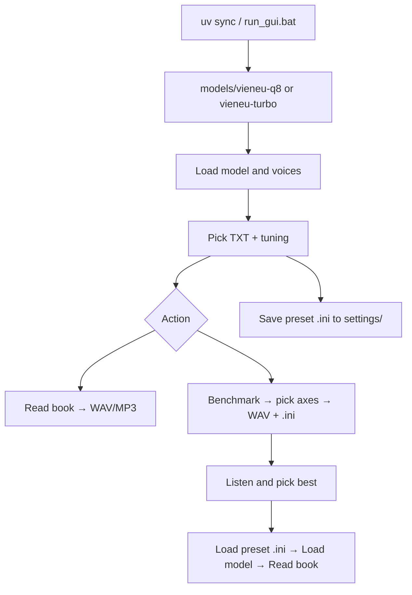

# Txt2Audio — TXT books → audio (VieNeu-TTS)

| | |
|---|---|
| **Author** | **Pham Trong Lam** — [phamtronglam2001@gmail.com](mailto:phamtronglam2001@gmail.com) |
| **GitHub** | [github.com/phamtronglam2001/Txt2Audio](https://github.com/phamtronglam2001/Txt2Audio) |
| **License** | [MIT](LICENSE) |
| **Tiếng Việt** | [README.md](README.md) |

A **desktop GUI (Tkinter)** app that reads **TXT** files (books, long documents) with **VieNeu-TTS** ([`vieneu`](https://pypi.org/project/vieneu/) on PyPI) and exports **WAV** or **MP3**. Supports two **offline CPU GGUF** model lines:

| Model line | Hugging Face repo | SDK backend | Folder under `models/` |
|------------|-------------------|-------------|-------------------------|
| **Turbo** | [VieNeu-TTS-v2-Turbo-GGUF](https://huggingface.co/pnnbao-ump/VieNeu-TTS-v2-Turbo-GGUF) | `turbo` | `vieneu-turbo/` |
| **Q8 (standard)** | [VieNeu-TTS-q8-gguf](https://huggingface.co/pnnbao-ump/VieNeu-TTS-q8-gguf) | `standard` | `vieneu-q8/` |

The app **infers the model type from the `.gguf` filename** (e.g. `turbo`, `q8`) — no manual repo picker. Each line uses a **separate directory tree** (ONNX codec, `voices.json`) so Turbo and Q8 presets are not mixed.

> **Legal / content:** generated audio may include **AI watermarking** per upstream docs. Use responsibly; credit VieNeu-TTS when distributing.

---

## Main features

- **GUI:** pick TXT, output folder/name, preset voice or **clone** from WAV/MP3/FLAC.
- **Long books:** segment by paragraphs / sentences / char limits; join PCM with silence and crossfade.
- **Two backends:** Turbo and Q8 (`LocalPathStandardVieNeuTTS` + local ONNX codec).
- **Portable models:** weights live in `models/` — copy the project to another machine.
- **Export WAV** (24 kHz) or **MP3** via **ffmpeg** (128 / 32 kbps).
- **TTS tuning:** temperature, top_k, infer chunk size, silence, crossfade, etc.
- **Auto Q8/Turbo defaults** when changing GGUF or after “Load model & voices” (unless a preset `.ini` with `[tuning]` was just loaded).
- **`.ini` presets:** save / load **multiple** GUI config files (`settings/` or any path).
- **Voice benchmark:** dialog to pick sweep axes → many WAVs + **matching `.ini`** files for comparison and re-import.

---

## GUI workflow



1. **Models root** — default `./models`.
2. **GGUF file** — `vieneu-q8/....gguf` or `vieneu-turbo/....gguf`.
3. **“Load model & voices”** — wait, then choose voice (or clone).
4. Adjust **tuning** (or **Load preset** from a saved `.ini`).
5. **“Start reading”** or **“Voice benchmark”** (choose axes in the dialog).
6. **“Stop”** — cancel after the current step.

---

## Project layout

```
Txt2Audio/
  README.md / README_EN.md
  LICENSE
  pyproject.toml
  uv.lock
  requirements.txt
  run_gui.bat
  settings/              # user-saved preset .ini
  models/                # gitignored — GGUF, ONNX, voices
  scripts/
  src/txt2audio/
    app.py
    tts_worker.py
    text_chunker.py
    synthesis_tuning.py
    gui_settings.py
    benchmark.py
    benchmark_plan.py
    benchmark_dialog.py
    ...
```

---

## Offline models

- **Turbo:** `.gguf` in `models/vieneu-turbo/`.
- **Q8:** `.gguf` in `models/vieneu-q8/` plus **`neucodec-onnx/`**.

```powershell
cd d:\CodeApp\Txt2Audio
.\.venv\Scripts\python.exe scripts\import_hf_cache_to_models.py
.\.venv\Scripts\python.exe scripts\import_hf_cache_to_models.py --repo q8
.\.venv\Scripts\python.exe scripts\migrate_models_to_split_dirs.py
```

---

## Install & run

```powershell
cd d:\CodeApp\Txt2Audio
uv sync
```

- Python **>= 3.10, < 3.14**; **≥ 8 GB RAM** recommended.
- **ffmpeg** required for MP3.

```powershell
uv run txt2audio
# or
run_gui.bat
```

**Pip:** `pip install -r requirements.txt` (includes `vieneu` and `neucodec`).

---

## Tuning panel

| Parameter | Meaning |
|-----------|---------|
| **segment_chars** | Max size per *book segment* (default 8000). Splits on `\n\n`, then sentences — not a hard 8000-char chop. |
| **infer_max_chars** | Max length per `infer` call inside a segment. |
| **silence_between_s** | Silence when joining book segments (pacing / “breath” between large chunks). |
| **crossfade_between_s** | Crossfade between book segments. |
| **infer_silence_p** | Silence between infer chunks (**Q8**). |
| **infer_crossfade_p** | Infer crossfade (**Q8**). |
| **temperature** | Strongest effect on voice character. Q8 ~1.0; Turbo ~0.4. |
| **top_k** | Top-k sampling. |
| **skip_normalize** | Skip **text normalization** before infer (see below). |
| **turbo_max_tokens** | Token limit per infer (**Turbo**). |
| **show_infer_progress** | Console progress bar (**Turbo**). |

**Default Q8 / Turbo** buttons reset suggested values.

**Auto:** changing GGUF or finishing model load applies backend defaults (not overwritten if you just **loaded a preset** with `[tuning]`).

### What is `skip_normalize`?

- **Not** audio normalization (volume, EQ).
- **Text** normalization (numbers → spoken form, abbreviations, punctuation) before phonemize/G2P.
- **Off** (default): best for typical books with numbers and symbols.
- **On:** only if TXT is already cleaned manually; may misread numbers.
- **Q8:** effect is clear. **Turbo:** SDK may still normalize inside `phonemize_text` — checkbox may change little.

**Natural sound tips:** raise infer/book silence (Q8), lower `temperature` slightly; avoid very small `infer_max_chars`.

---

## Settings presets (`.ini` files)

Saves the **full GUI state** (paths, model, voice, output, tuning) — not hidden config in code.

| Button | Action |
|--------|--------|
| **Save preset…** | Pick filename (e.g. `settings/turbo_binh.ini`) |
| **Load preset…** | Open any `.ini` |
| **Load from list** | Combobox of `.ini` files in `settings/` |

After **Load preset:** click **“Load model & voices”** to apply saved GGUF and voice.

Sections: `[meta]`, `[paths]`, `[model]`, `[output]`, `[tuning]`.

---

## Voice benchmark

### Before running

- Same as reading: model loaded, voice or clone selected, TXT chosen.
- Click **Voice benchmark** → **axis selection dialog** (tick groups, preview file count).

### Sweep axes (each value = 1 WAV + 1 `.ini`)

| Axis | Notes |
|------|--------|
| **Baseline** | 1 file — current tuning panel |
| **Temperature** | Turbo: 8 levels (0.25–0.6); Q8: 10 levels (0.7–1.25) |
| **infer_silence_p** | 7 levels — **Q8 only** |
| **silence_between_s** | 8 levels |
| **infer_max_chars** | 7 levels (192–640) |
| **top_k** | 5 levels (off by default) |
| **Infer / book crossfade** | Off by default |
| **Natural combo** | 1 file — temp + longer silence |

Dialog buttons: **Suggested defaults** / **Select all** / **Select none**.

### Output

Folder `benchmark_<txt_stem>_<timestamp>/`:

- `07_book_silence_long__temp1__max384__sb0.35__si0.15.wav`
- `07_book_silence_long__temp1__max384__sb0.35__si0.15.ini` — same stem, import via **Load preset**
- `summary.txt` — variant / wav / ini / description / params

**Filename keys:** `temp` = temperature, `max` = infer_max_chars, `sb` = silence_between_s, `si` = infer_silence_p (Q8).

**Suggested flow:** Benchmark → listen → **Load preset** matching `.ini` → **Load model** → **Start reading** (or **Save preset** under `settings/`).

**Benchmark sample** spinbox — first N characters of TXT (default 500). Always **WAV** (no ffmpeg).

---

## Text & audio pipeline

1. Read UTF-8 TXT.
2. `book_segments()` — paragraph / sentence / hard cut.
3. `infer` with `infer_max_chars` + `SynthesisTuning`.
4. `join_audio_chunks` → WAV/MP3 export.

Long books may run for hours; GUI stays responsive via a worker thread.

---

## Voices

- **Presets** from `voices.json` per repo (Q8 ≠ Turbo).
- **Clone** from reference audio (overrides preset when reading).
- Change GGUF → **reload model**.

---

## Troubleshooting

| Symptom | Fix |
|---------|-----|
| `No module named 'neucodec'` | Run `uv sync` |
| Wrong voice family | Separate `vieneu-q8` / `vieneu-turbo`; reload model |
| Empty audio | Check `.gguf` name; Q8 needs `neucodec-onnx/` |
| MP3 fails | Install or point to ffmpeg |
| Robotic / choppy | Silence + temperature; use **Benchmark** + `.ini` preset |
| Benchmark too slow | Uncheck axes in dialog (e.g. temperature only) |

---

## Dependencies

- [`vieneu`](https://pypi.org/project/vieneu/)
- [`neucodec`](https://pypi.org/project/neucodec/)
- **llama-cpp-python** (wheel index in `pyproject.toml`)
- **ffmpeg** (MP3 only)

---

## License & upstream

- **Txt2Audio source:** [MIT License](LICENSE) — Copyright (c) 2026 Pham Trong Lam ([phamtronglam2001@gmail.com](mailto:phamtronglam2001@gmail.com)).
- **Third-party libs / models / binaries:** [THIRD_PARTY_NOTICES.md](THIRD_PARTY_NOTICES.md) (VieNeu weights, `vieneu`, `neucodec`; **ffmpeg not bundled**).
- **Hugging Face models:** [Turbo GGUF](https://huggingface.co/pnnbao-ump/VieNeu-TTS-v2-Turbo-GGUF), [Q8 GGUF](https://huggingface.co/pnnbao-ump/VieNeu-TTS-q8-gguf) — typically Apache-2.0; download into `models/`, **do not** commit to git.
- **ffmpeg:** install locally or set path in GUI; **not recommended** to commit ffmpeg binaries (LGPL/GPL — see THIRD_PARTY_NOTICES).
- Credit **Powered by VieNeu-TTS** when shipping products using upstream models.

---

## Future ideas (not implemented)

- TXT encodings (CP1258, …).
- PyInstaller `.exe`.
- Per-chapter output files.

---

## Author

**Pham Trong Lam**  
Email: [phamtronglam2001@gmail.com](mailto:phamtronglam2001@gmail.com)  
Repository: [github.com/phamtronglam2001/Txt2Audio](https://github.com/phamtronglam2001/Txt2Audio)  
License: [MIT](LICENSE) · Third-party: [THIRD_PARTY_NOTICES.md](THIRD_PARTY_NOTICES.md)
